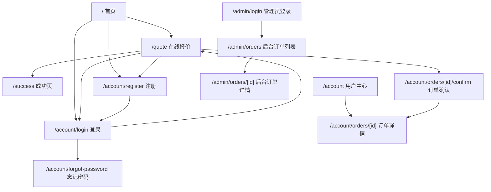
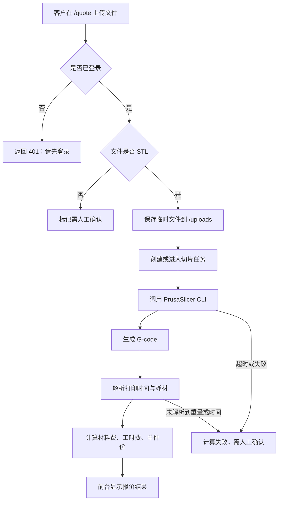
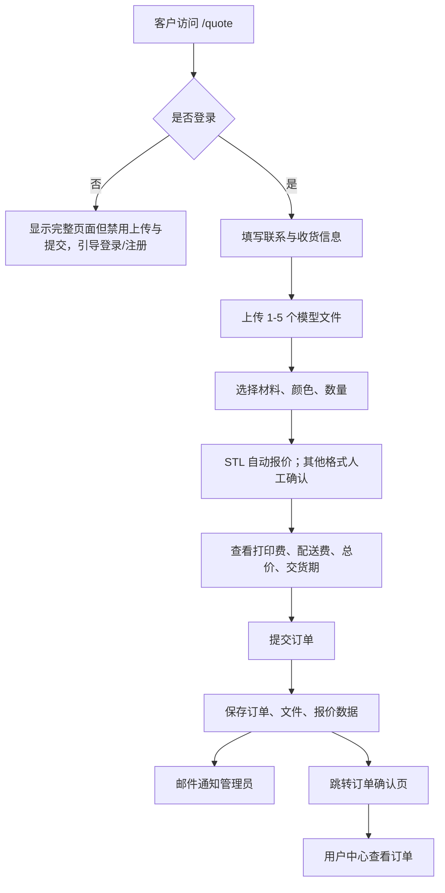
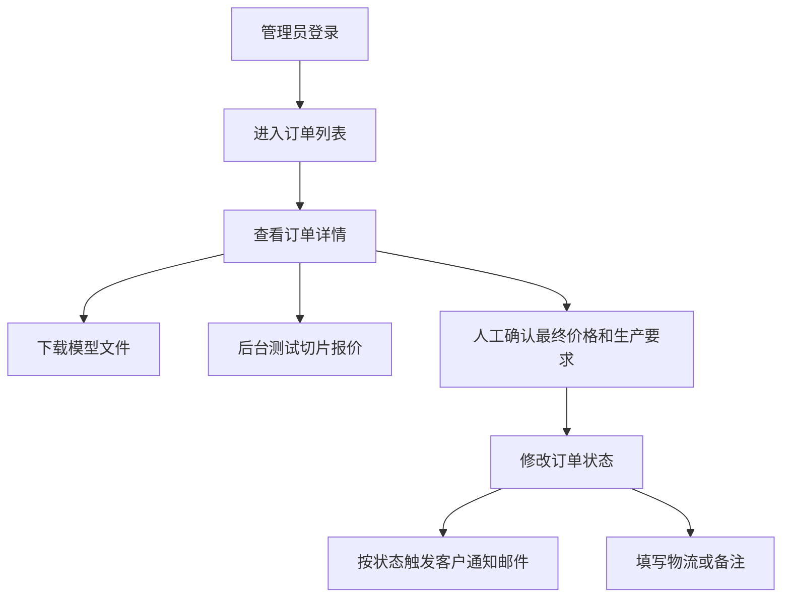
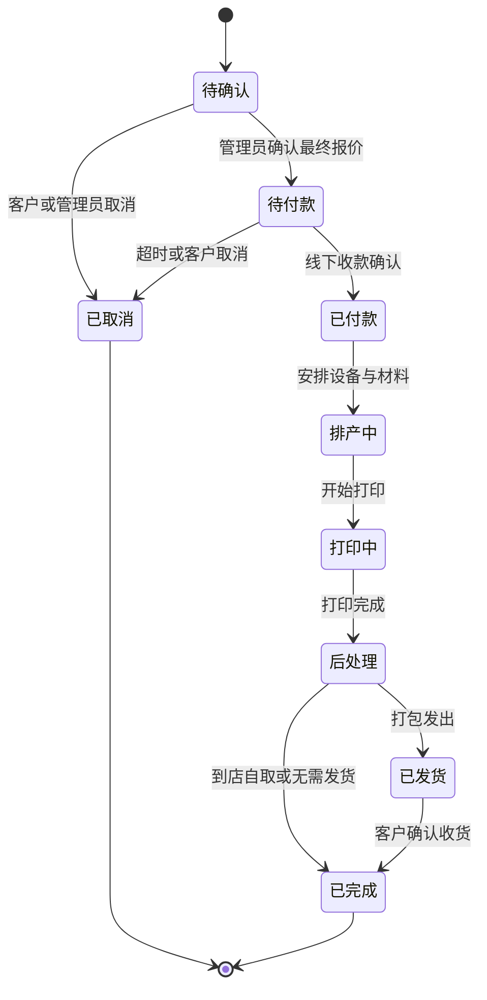
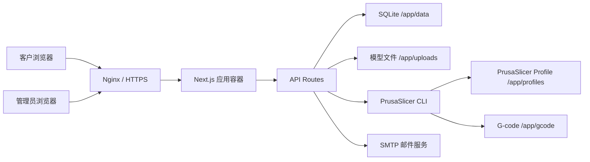

# Make3D 在线 3D 打印接单系统建设计划书

版本：V1.2 会员与自动报价稳定版  
日期：2026-06-07  
项目定位：面向 3D 打印接单、在线报价、会员下单与后台生产管理的业务系统

## 1. 项目目标

Make3D 在线 3D 打印接单系统的建设目标，是将原本依赖人工沟通的模型收集、报价确认、订单跟进和生产状态反馈，整理为可持续迭代的线上流程。

核心目标包括：

- 支持客户 24 小时在线注册、登录、上传模型并提交打印需求。
- 对 STL 文件提供基于 PrusaSlicer 的自动切片报价能力，降低初次报价沟通成本。
- 对 STEP、STP、3MF 等暂未自动切片的文件保留人工确认路径。
- 建立订单、文件、切片记录、会员账号、状态日志等基础数据结构。
- 支持管理员在后台查看订单、下载模型、测试切片、修改状态并补充物流与备注信息。
- 保持人工最终确认机制，避免自动报价直接替代生产判断。
- 为后续微信公众号通知、在线支付、自动排产、文件对象存储和更复杂生产管理预留接口与数据基础。

## 2. 当前已完成功能

当前系统已完成可上线运行的 MVP 功能闭环：

- 技术框架：Next.js、TypeScript、Tailwind CSS。
- 数据存储：SQLite 初始化，支持 `orders`、`files`、`customers`、`slice_jobs`、`order_status_logs`、`auth_blocks` 等核心表。
- 文件上传：支持 `.stl`、`.step`、`.stp`、`.3mf`，单文件最大 50MB，最多 5 个文件，保存到 `/uploads`。
- 会员系统：客户注册、登录、退出、账号页、订单历史、登录后才能使用报价与下单。
- 客户登录安全：手机号作为账号，密码 hash 保存，客户 session 使用 `customer_session` httpOnly cookie；客户登录失败按 phone 和 IP 分级封禁。
- 报价页：多文件拖拽上传、每个文件独立材料、颜色、数量，自动切片状态反馈和订单汇总。
- 自动报价：STL 文件调用 PrusaSlicer CLI 自动切片；解析 G-code 中打印时间和耗材数据；根据材料费、工时费、包装费、配送费计算价格。
- 订单提交：提交订单后进入 `/account/orders/[id]/confirm` 确认页，初始状态为“待确认”。
- 用户中心：展示用户资料、我的订单、历史报价、订单详情、再次下单入口。
- 管理员后台：管理员登录、订单列表、订单详情、文件下载、状态修改、手动测试切片报价、状态历史记录。
- 邮件通知：新订单通知管理员；订单状态变为待付款、打印中、已发货、已完成时通知客户。
- Docker 部署：提供 Dockerfile、docker-compose.yml、`.env.production.example`，挂载 `/data`、`/uploads`、`/profiles`、`/gcode`，生产容器包含 PrusaSlicer。
- 线上验证：已完成登录、自动报价、订单提交、订单确认页、后台可见订单的完整链路验证。

## 3. 前台页面结构

前台页面面向客户使用，重点是降低下单门槛，同时保持自动报价结果的边界提示。

主要页面：

- `/` 首页：服务入口、报价入口、联系信息、登录状态。
- `/quote` 在线报价页：模型上传、文件卡片、材料颜色数量选择、自动报价状态、联系与收货信息、订单汇总、提交订单。
- `/success` 成功页：保留旧提交成功路径，当前主要订单提交后跳转到订单确认页。
- `/account/register` 注册页：手机号、密码、姓名、微信、邮箱。
- `/account/login` 登录页：手机号、密码登录，失败提示和封禁状态提示。
- `/account/logout` 退出路由：兼容 GET 访问，并防止 Next.js 预取误清 session。
- `/account/forgot-password` 忘记密码页：V1 仅展示输入框和统一提示。
- `/account` 用户中心：首页展示资料、订单列表和历史报价。
- `/account/orders/[id]` 用户订单详情：仅允许查看自己的订单。
- `/account/orders/[id]/confirm` 付款前确认页：订单提交后的确认信息与付款提示。

页面层级结构图：



## 4. 会员系统结构

会员系统 V1 的目标不是复杂 CRM，而是解决“谁在提交订单、能否查看自己的历史订单、未登录是否能调用报价接口”的基础身份问题。

### 4.1 客户账号

客户账号使用手机号作为唯一登录账号。注册字段包括：

- 手机号：符合中国大陆手机号格式。
- 密码：至少 8 位，hash 后保存。
- 姓名：用于订单联系人。
- 微信：用于报价和生产细节沟通。
- 邮箱：用于后续找回密码和通知。

### 4.2 客户 Session

登录成功后，系统写入 `customer_session` cookie。

安全属性：

- `httpOnly`
- `sameSite=lax`
- `path=/`
- `COOKIE_SECURE=true` 时设置 `Secure`
- 使用 `SESSION_SECRET` 签名和校验

客户 session 与管理员 session 独立，不复用管理员登录逻辑。

### 4.3 权限控制

- 未登录客户可以访问首页、注册、登录、介绍内容。
- 未登录客户可以看到 `/quote` 页面结构，但上传、表单填写、自动报价和提交按钮禁用。
- `/api/quote/slice` 未登录返回 401。
- `/api/orders` 未登录返回 401。
- 已登录客户可以上传 STL 并触发自动切片报价，可以提交订单。
- 用户中心只能查看当前客户自己的订单。

### 4.4 登录防滥用

客户登录失败记录同时按手机号和 IP 两个维度写入 `auth_blocks`：

- 连续失败 3 次：阻断 10 分钟。
- 第一阶段结束后再次连续失败 3 次：阻断 24 小时。
- 第二阶段结束后再次连续失败 3 次：永久阻断。

管理员后台登录不受该机制影响。

## 5. 自动报价流程

自动报价当前仅针对 STL 文件。STEP、STP、3MF 文件保留上传和提交能力，但报价结果显示为“需人工确认”。

### 5.1 切片配置

生产容器内安装 PrusaSlicer，默认配置：

- `PRUSASLICER_ENABLED`
- `PRUSASLICER_BIN`
- `PRUSASLICER_PROFILE_PATH=/app/profiles/bambu-p1s.ini`
- `SLICE_TIMEOUT_SECONDS`
- `MAX_SLICE_CONCURRENCY`

默认配置文件 `profiles/bambu-p1s.ini` 面向 Bambu Lab P1S、0.4mm 喷嘴、0.2mm 层高、50% 填充。该配置仅作为估价基线，不代表最终生产配置。

### 5.2 价格规则

自动切片报价使用确定金额，不再展示价格区间。

单文件价格：

```text
单件打印价 = 材料费 + 工时费 + 分摊包装费
```

材料销售价：

- PLA：0.25 元/g
- PETG：0.20 元/g
- ABS：0.35 元/g

工时费：

- 打印小时数 × 1.5 元/小时
- 单文件不足 5 元按 5 元计算

包装费：

- 每单固定 3 元
- 前台不单独强调
- 按文件数量平均分摊到单件打印价

配送费：

- 普通快递：10 元
- 顺丰快递：18 元
- 到店自取：0 元
- 西安本地跑腿：人工确认，不计入自动总价

订单总价：

```text
应付总价 = 所有文件小计 + 配送费
最低订单金额 = 20 元
```

预计交货期：

```text
预计交货期 = ceil(所有成功切片文件总打印时间 / 6 台设备 + 24 小时)
```

若存在需人工确认的文件，则提示交货期以人工确认为准。

### 5.3 自动切片报价流程图



## 6. 订单提交流程

订单提交以会员登录为前置条件。客户在 `/quote` 完成上传和信息填写后提交订单。

提交内容包括：

- 客户姓名、手机号、微信、邮箱。
- 配送方式、收货地址、配送备注。
- 每个文件的文件名、材料、颜色、数量、单件价、小计。
- 自动切片结果：耗材重量、打印时间、材料费、工时费、原始解析字段。
- 订单级汇总：文件数量、总数量、打印费合计、配送费、应付总价、预计交货期。
- 客户备注。

提交成功后：

- 写入 `orders`。
- 写入 `files`。
- 写入或关联 `slice_jobs` 切片结果。
- 订单初始状态为“待确认”。
- 发送新订单邮件通知管理员。
- 跳转到 `/account/orders/[id]/confirm`。

用户下单流程图：



## 7. 后台订单管理流程

管理员后台用于人工确认报价、下载文件、跟进生产和通知客户。

主要页面：

- `/admin/login`：管理员登录。
- `/admin/orders`：订单列表。
- `/admin/orders/[id]`：订单详情。

订单列表显示：

- 订单编号
- 提交时间
- 客户姓名
- 电话
- 微信
- 材料
- 数量
- 状态
- 预估或应付价格
- 预计货期
- 配送方式

订单详情显示：

- 客户联系信息。
- 配送与收货信息。
- 文件列表：文件名、材料、颜色、数量、单价、小计、下载按钮。
- 自动切片记录：耗材重量、打印时间、材料费、工时费、包装费、自动计算总价、预计交货期、原始解析字段。
- 状态修改表单。
- 快递公司、快递单号、管理员备注。
- 状态历史记录。
- 客户历史订单数量。

后台流程：



## 8. 订单状态流转

当前统一订单状态：

- 待确认
- 待付款
- 已付款
- 排产中
- 打印中
- 后处理
- 已发货
- 已完成
- 已取消

状态变更时写入 `order_status_logs`，记录原状态、新状态、操作人和时间。当前后台操作人统一记录为 `admin`。

状态变更为以下状态时发送客户邮件：

- 待付款
- 打印中
- 已发货
- 已完成

订单状态流转图：



## 9. 微信公众号通知规划

当前系统已实现邮件通知，微信公众号通知作为后续增强规划。建议分阶段接入，避免一开始引入过多外部依赖。

### 9.1 通知目标

微信公众号通知主要覆盖：

- 注册或登录安全提醒。
- 新订单提交成功提醒。
- 管理员确认报价后待付款提醒。
- 打印中、已发货、已完成等状态变更提醒。
- 客户主动查询订单状态入口。

### 9.2 账号绑定方式

建议采用手机号绑定：

1. 客户关注公众号。
2. 在公众号菜单点击“绑定账号”。
3. 输入手机号或通过网页授权进入绑定页。
4. 系统将公众号 openid 与客户 `customers.id` 建立关联。

后续可新增 `wechat_accounts` 表：

| 字段 | 说明 |
| --- | --- |
| id | 主键 |
| customer_id | 关联客户 |
| openid | 公众号用户标识 |
| unionid | 可选，跨应用用户标识 |
| subscribed | 是否关注 |
| created_at | 创建时间 |
| updated_at | 更新时间 |

### 9.3 模板消息或订阅消息

推荐先实现订单状态订阅消息：

- 订单待付款通知。
- 订单开始打印通知。
- 订单发货通知。
- 订单完成通知。

V1 邮件通知继续保留，微信公众号通知作为并行通道，避免单一通知方式失败。

## 10. 后续开发路线图

### 阶段 A：稳定运营与数据整理

目标：确保当前线上流程可靠，减少人工维护成本。

计划内容：

- 完善后台筛选、搜索、分页。
- 增加订单导出。
- 优化管理员订单详情页的报价确认表单。
- 清理测试订单和异常切片记录。
- 增加数据库备份脚本。

### 阶段 B：微信公众号通知

目标：让客户通过微信及时收到状态变更。

计划内容：

- 新增微信账号绑定。
- 接入公众号订阅消息。
- 后台状态变更时同时发送邮件和微信通知。
- 用户中心增加绑定状态展示。

### 阶段 C：付款确认与财务记录

目标：规范待付款、已付款和订单金额确认流程。

计划内容：

- 后台确认最终价格。
- 用户待付款页面展示付款方式。
- 记录付款时间、付款金额、付款备注。
- V1 先支持线下付款记录，后续再接微信支付或支付宝。

### 阶段 D：生产排产与设备管理

目标：面向 6 台 Bambu Lab P1S 建立更细的生产计划。

计划内容：

- 新增设备表。
- 后台分配订单到设备。
- 记录预计开始和完成时间。
- 识别多文件订单的并行生产计划。
- 打印失败、重打、补件记录。

### 阶段 E：文件存储与异步任务升级

目标：提升大文件和高并发场景下的可靠性。

计划内容：

- OSS 或对象存储直传。
- 异步队列处理切片任务。
- 限制切片并发，增加任务状态轮询。
- G-code 文件归档策略。

### 阶段 F：自动报价规则增强

目标：让自动报价更接近生产实际。

计划内容：

- 支撑体积、失败风险、耗材类型、喷嘴尺寸、层高差异计价。
- 识别超出设备尺寸、过小模型、薄壁模型等风险。
- 增加人工调价记录。
- 统计自动报价与最终成交价差异，优化规则。

## 11. 每阶段预期效果

| 阶段 | 预期效果 | 主要衡量指标 |
| --- | --- | --- |
| 已完成 MVP | 客户可登录、上传、自动报价、提交订单，管理员可处理订单 | 线上订单能完整创建，后台可下载文件 |
| 阶段 A 稳定运营 | 降低后台处理成本，提高数据可维护性 | 管理员查询订单更快，异常订单可追踪 |
| 阶段 B 微信通知 | 提升客户响应速度，减少人工催问 | 状态变更通知触达率提升 |
| 阶段 C 付款确认 | 形成订单金额确认和收款记录 | 待付款、已付款状态更清晰 |
| 阶段 D 生产排产 | 支持多设备生产安排 | 订单预计完成时间更准确 |
| 阶段 E 存储与队列 | 支持更大文件和更稳定切片 | 切片失败率下降，上传更稳定 |
| 阶段 F 报价增强 | 自动报价更接近最终成交价 | 自动报价与人工报价偏差降低 |

## 12. 核心数据结构

当前核心数据表如下：

| 表名 | 用途 |
| --- | --- |
| `customers` | 客户账号、手机号、密码 hash、姓名、微信、邮箱 |
| `auth_blocks` | 客户登录失败和分级封禁记录 |
| `password_reset_tokens` | 密码重置 token hash 和有效期，后续可启用完整流程 |
| `orders` | 订单主表，包含客户信息、配送信息、状态、价格、货期 |
| `files` | 上传文件表，包含文件路径、材料、颜色、数量、单价、小计和模型预留字段 |
| `slice_jobs` | 自动切片任务和结果，包含 G-code 路径、耗材重量、打印时间、报价数据 |
| `order_status_logs` | 订单状态变更历史 |

数据边界：

- 用户上传的 3D 模型文件仅保存和切片，不作为可执行程序运行。
- PrusaSlicer 调用使用参数数组，不进行 shell 字符串拼接。
- V1/V2 当前自动报价仍需人工最终确认。
- 管理员后台与客户账号使用独立 session，不混用权限。

## 13. 系统架构图



## 14. 风险与控制措施

| 风险 | 当前控制 | 后续建议 |
| --- | --- | --- |
| 未登录调用报价或提交订单 | API 统一校验 customer session | 增加更多端到端测试 |
| 登录暴力尝试 | SQLite auth_blocks 按手机号和 IP 分级封禁 | 后续可接 Redis 或 WAF |
| 上传大文件导致资源压力 | 单文件 50MB、最多 5 文件、IP 限流 | OSS 直传和异步队列 |
| 切片任务占用 CPU/内存 | `MAX_SLICE_CONCURRENCY=1`、超时控制 | 独立 worker 或任务队列 |
| 自动报价不准确 | 页面明确最终人工确认 | 记录最终价差并优化规则 |
| Cookie 在 HTTPS/HTTP 环境异常 | `COOKIE_SECURE` 可配置 | 部署检查脚本 |
| 数据丢失 | Docker volume 挂载 data/uploads | 自动备份 SQLite 和上传文件 |

## 15. 近期建议事项

建议优先处理以下事项：

1. 建立服务器备份策略：至少备份 SQLite 数据库、上传文件和 profiles 配置。
2. 后台增加订单搜索和状态筛选，降低订单增长后的管理成本。
3. 增加“最终报价确认”字段，区分自动报价与人工确认价。
4. 将测试订单和真实订单在后台做标记或清理机制。
5. 梳理微信公众号接入所需主体、模板消息权限和账号绑定流程。
6. 为 Docker 构建较慢问题评估服务器内存或 CI 构建镜像方案。

## 16. 总结

Make3D 当前已经从基础接单页面升级为具备会员登录、自动切片报价、订单提交、用户中心、后台管理、状态流转和邮件通知的可运营系统。系统的关键设计原则是：自动化用于减少重复沟通和生成参考报价，最终生产决策仍由人工确认。

后续建设应围绕“通知触达、付款确认、生产排产、存储队列、报价精度”五条主线逐步推进。这样既能保持当前系统稳定运营，也能为更完整的 3D 打印接单和生产管理平台打好基础。
